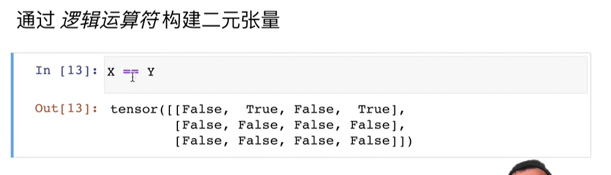
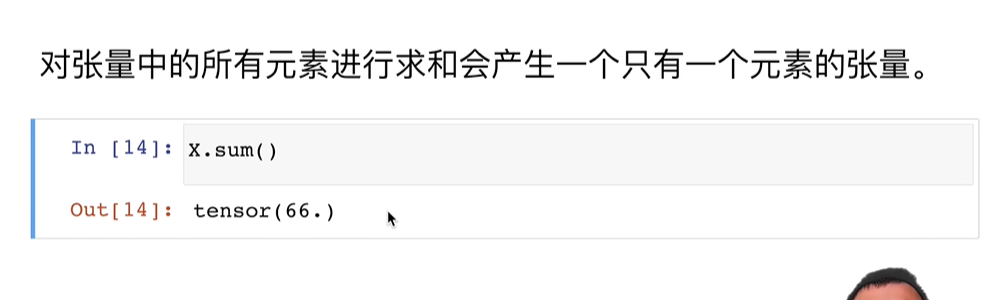
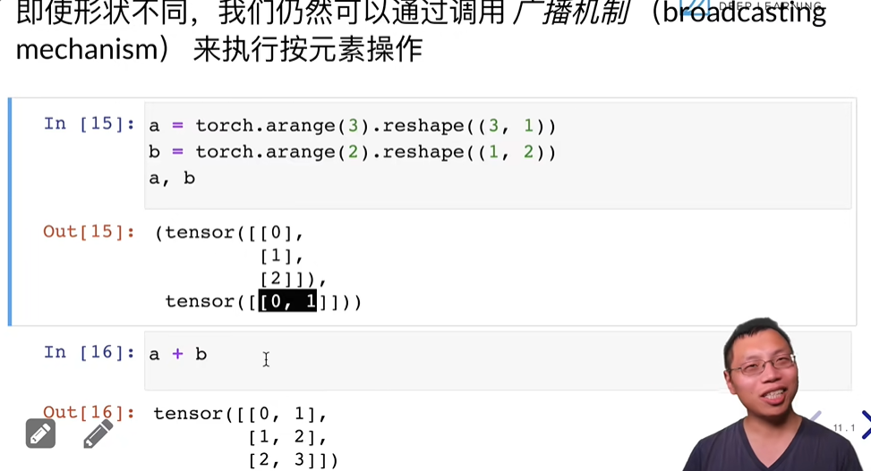
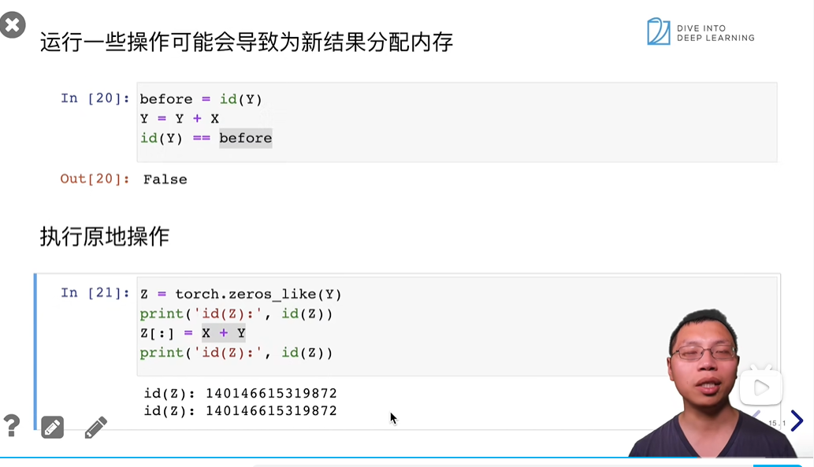
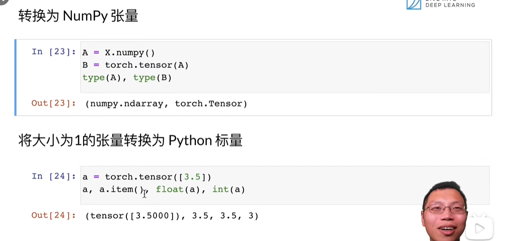

**1.访问元素**：
遵循数字为索引且左闭右开原则。
特殊情况：[::3,::2]中的“::3"表示的是初始位置，结束位置，步长

**2.创建张量**
`torch.arange(type(int number))`：生成0-[number-1]按顺序排列的一维数组

**3.改变张量形状**
`x.reshape(3,4)`:把张量改成3*4的二维数组

**4.全0，全1**
`torch.zeros((2,3,4)),torch.ones((2,3,4))`

**5.自定义赋值**
`torch.tensor([[2,1,4,3],[1,2,3,4],[4,3,2,1]])`

**6.查看张量形状**
`x.shape`

**7.标准运算符**
`+,-,*,/,**,exp(x)`

**7.合并张量**
`torch.cat((x,y),dim=0),torch.cat((x,y),dim=1)`
其中dim=0指的时按照第0维堆起来，那么第合并之后的张量的第0维的长度就是两者之和

**8.逻辑运算符**
`==`

**9.求和**
`x.sum()`
对张量中的所有元素求和

**10.广播机制**
如果两个张量形状不一样，但是维度是一样的，即使每个维度的长度不一样也可以相加，并在各自维度扩张成长度最大的一方。

**11.内存问题**
这里就有点像引用数据类型，你对引用数据类型对象进行copy操作，它们的地址是不同的，如果单纯是对该对象的内部数据进行操作，它们的地址是没有变化的。

**12.numpy对象转torch对象，张量转标量**
