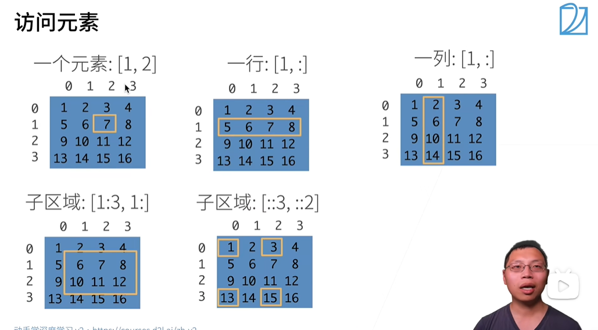
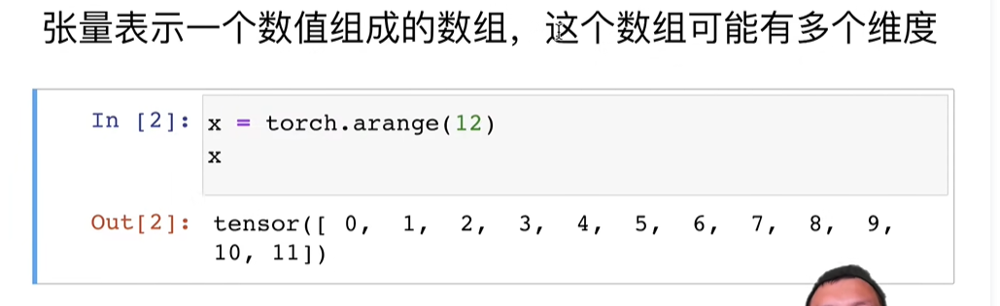
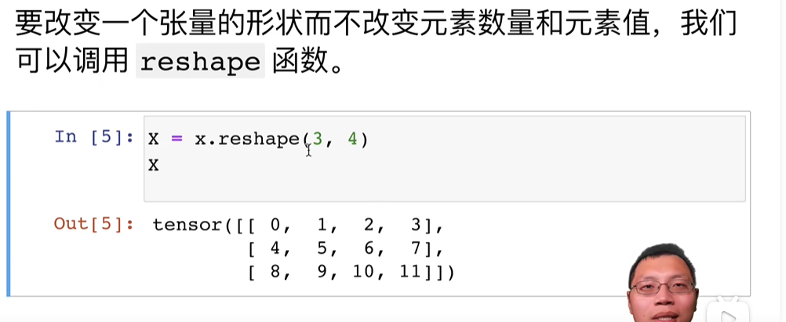
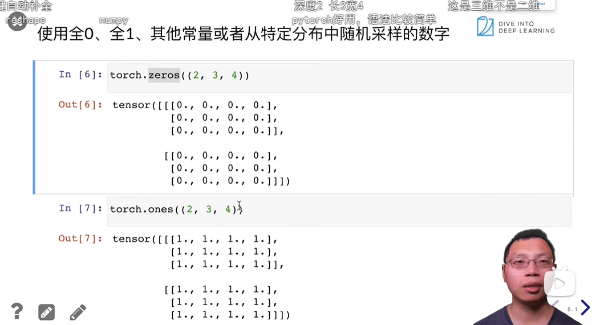
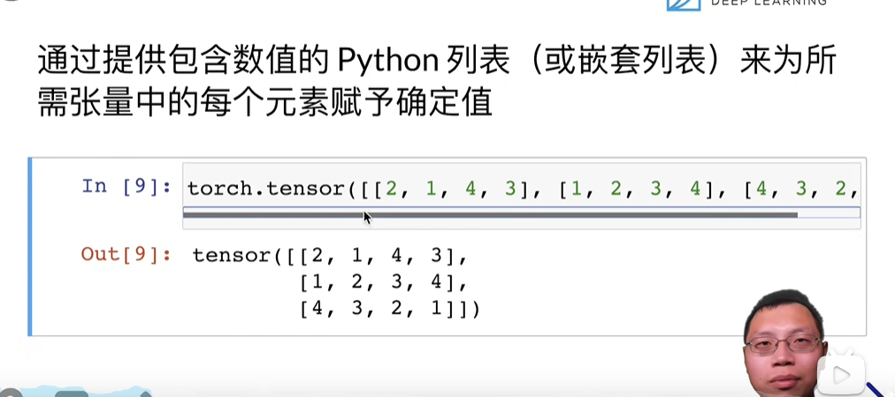
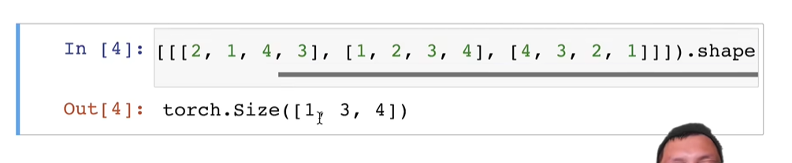
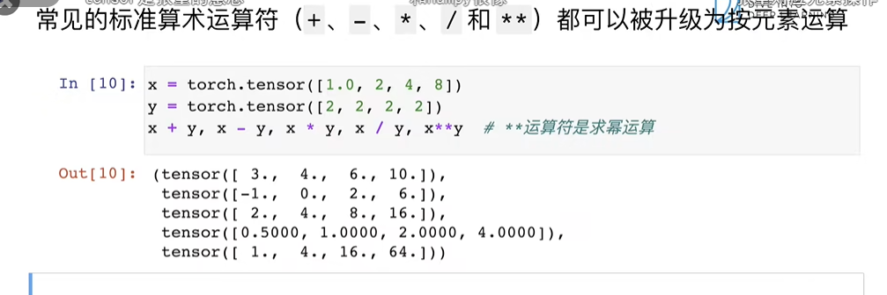
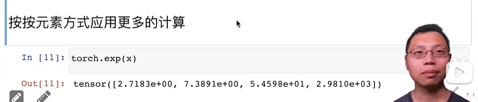
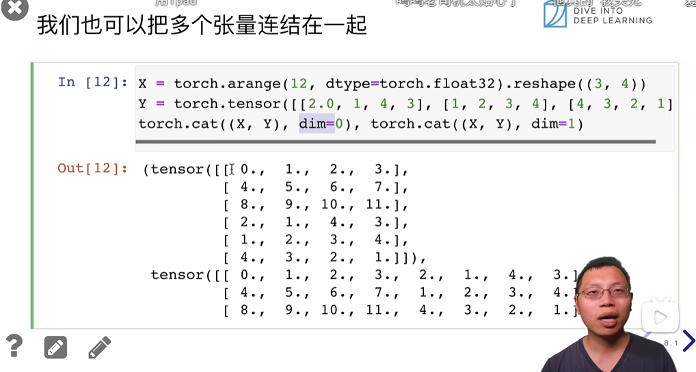

**1.访问元素**：
遵循数字为索引且左闭右开原则。
特殊情况：[::3,::2]中的“::3"表示的是初始位置，结束位置，步长

**2.创建张量**
`torch.arange(type(int number))`：生成0-[number-1]按顺序排列的一维数组

**3.改变张量形状**
`x.reshape(3,4)`:把张量改成3*4的二维数组

**4.全0，全1**
`torch.zeros((2,3,4)),torch.ones((2,3,4))`

**5.自定义赋值**
`torch.tensor([[2,1,4,3],[1,2,3,4],[4,3,2,1]])`

**6.查看张量形状**
`x.shape`

**7.标准运算符**
`+,-,*,/,**,exp(x)`

**7.合并张量**
`torch.cat((x,y),dim=0),torch.cat((x,y),dim=1)`
其中dim=0指的时按照第0维合并
