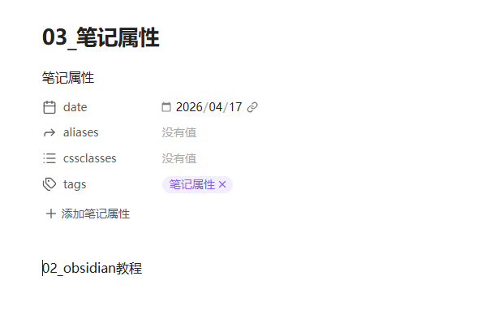
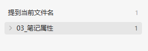

# 笔记属性

- 用`---`可以打开笔记属性

# 一级标题
- 用`# 一级标题`可以建立标题

# 二级标题
- 用`## 二级标题`可以添加二级标题

# point
- 用`- `可以创建point
====
# 笔记链接
- 用`[[]]`可以创建笔记之间跳转链接
- [笔记属性](笔记属性.md)

# 笔记名链接
- 在当前笔记在其他笔记名中被提到，那么可以查看当前笔记被哪些笔记提到过 

# 快捷键
- ==ctrl +o== 可以创建文件
- **ctrl + p** 可以搜索markdown的用法
