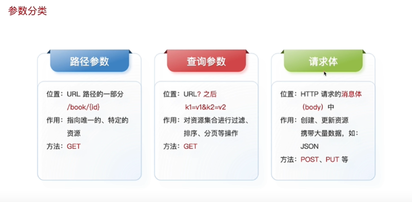
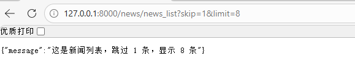
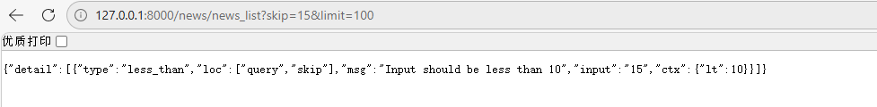
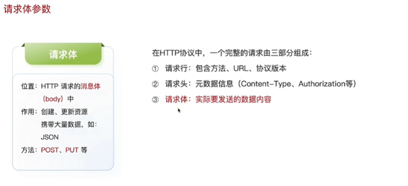

# Path函数
给路径参数添加范围限制，注解。
```
@app.get("/book/{id}")

async def say_hello(id: int = Path(..., title="The ID of the book", ge=1, le=1000)):

    return {"message": f"这是第 {id} 本书"}

  

@app.get("/book/{name}")

async def say_hello(name: str = Path(..., title="The name of the book", min_length=1, max_length=10)):

    return {"message": f"这是书名 {name}"}
```

# 查询参数
可以使用Query函数对查询参数进行注解和范围限制
```
 @app.get("/news/news_list")

async def news_list(

    skip: int = Query(0, description="Number of items to skip",lt=10),

    limit: int = Query(10, description="Number of items to limit")

    ):

    return {"message": f"这是新闻列表，跳过 {skip} 条，显示 {limit} 条"}
```


# 请求体参数
