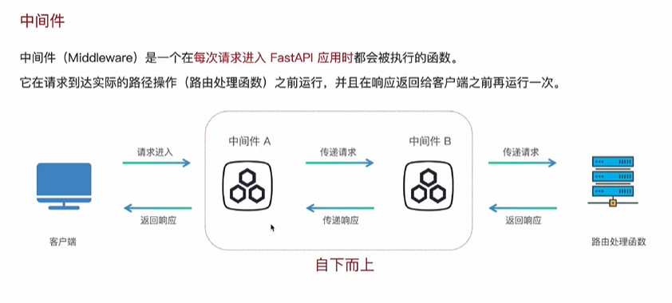
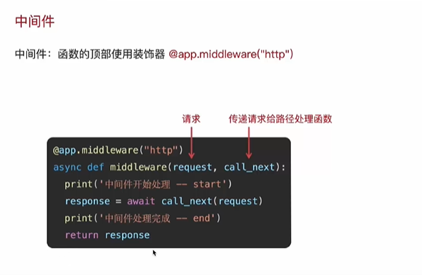
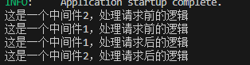
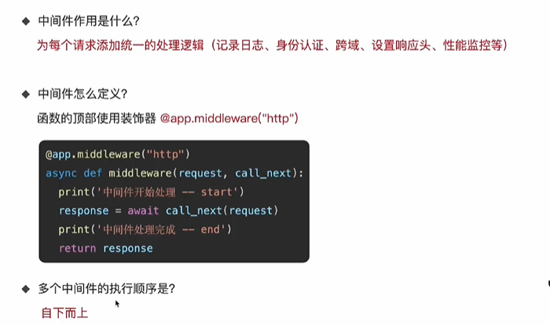

```
# 中间件

@app.middleware("http")

async def middleware(request, call_next):

    print("这是一个中间件1，处理请求前的逻辑")

    #等待结果要用await

    response = await call_next(request)

    print("这是一个中间件1，处理请求后的逻辑")

    return response

  

@app.middleware("http")

async def middleware2(request, call_next):

    print("这是一个中间件2，处理请求前的逻辑")

    #等待结果要用await

    response = await call_next(request)

    print("这是一个中间件2，处理请求后的逻辑")

    return response
```

