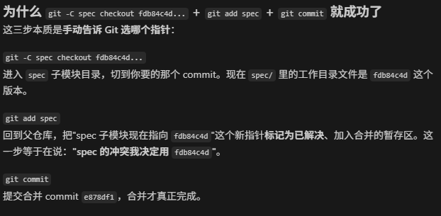

最常用的一行：

powershell

git checkout -b feature/my-branch

或者用新写法（Git 2.23+）：

powershell

git switch -c feature/my-branch

`feature/my-branch` 替换成你想要的分支名。这会基于当前 `main` 创建新分支并切换过去。

# 推到你的 fork（第一次推送）

powershell

git push -u origin feature/my-branch

`-u` 绑定上游后，以后在这个分支 `git push` / `git pull` 就不用再写远程名和分支名了。

# 常用操作速查

- **查看所有分支**：`git branch`（当前分支前面有 `*`）
    
- **切换到已有分支**：`git switch 分支名` 或 `git checkout 分支名`
    
- **切回 main**：`git switch main`
    
- **删除本地分支**：`git branch -d 分支名`（已合并）或 `-D`（强制）
    

# 小建议

取名时用有意义的前缀，比如：

- `feature/xxx` 新功能
    
- `fix/xxx` 修 bug
    
- `docs/xxx` 文档

