# 字节流

## fileoutputstream

## fileinputstream

### 循环读取

### 拷贝文件

### 正确
的copy方法,不会漏掉数据

# 字符集

## 英文

## 中文

## UTF

## 为什么会有乱码

# 编码解码方式

# 字符流

## FileReader

## FileWriter

## copy整个文件夹

## 文件加密解密

# 字节缓冲流

## BufferedInputStream

# 字符缓冲流
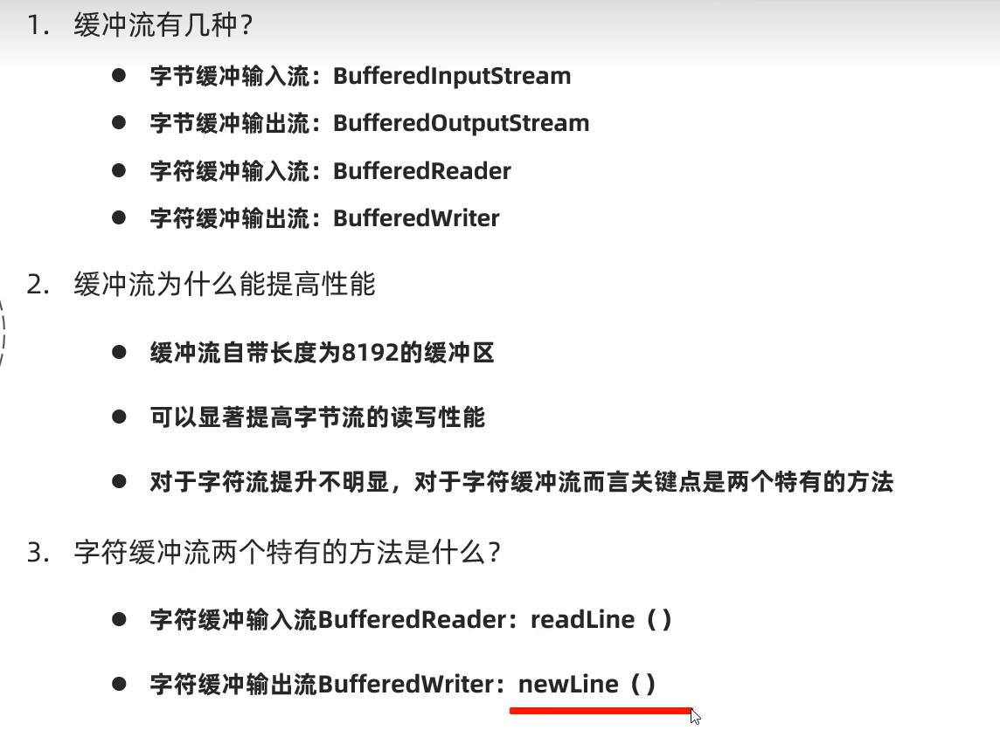

# 转换流

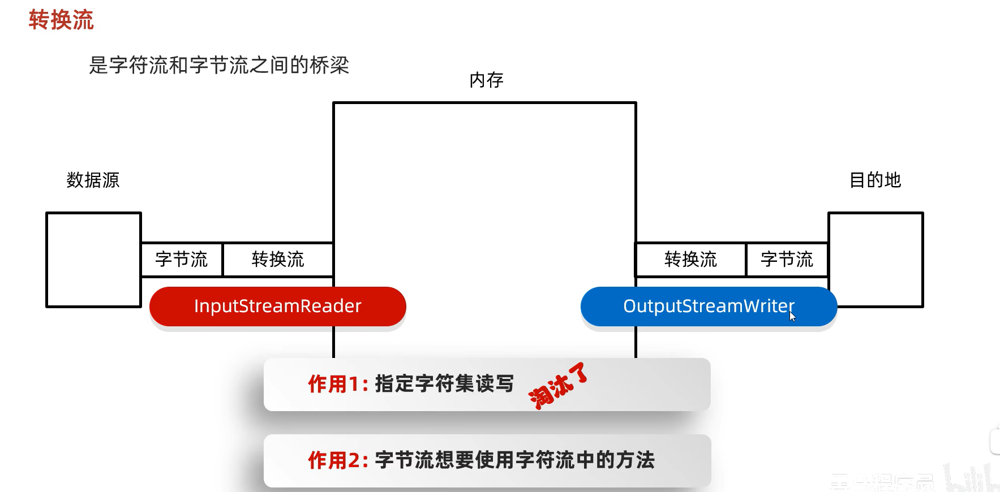
## InputStreamReader
被淘汰了
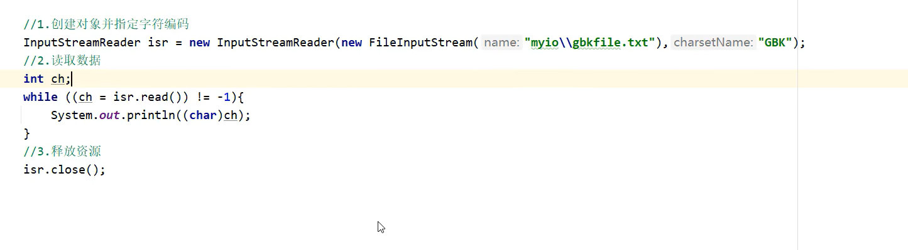新的方法
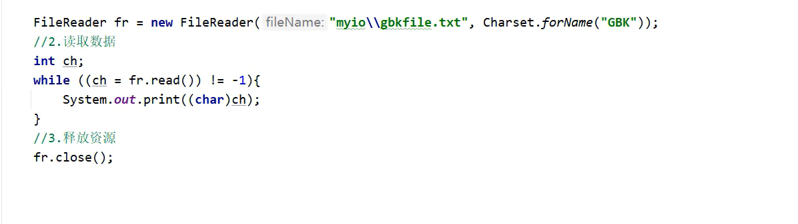

## OutputStreamWriter
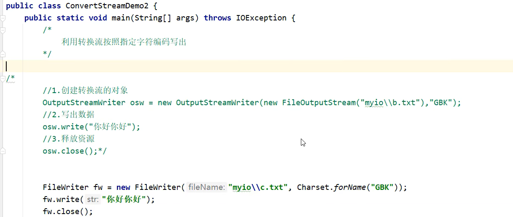

## 转换不同编码
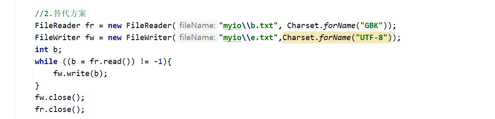

# 序列化流
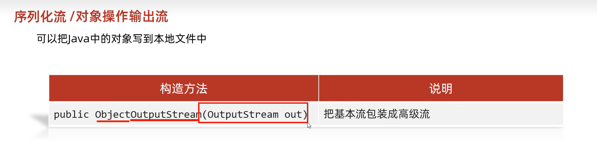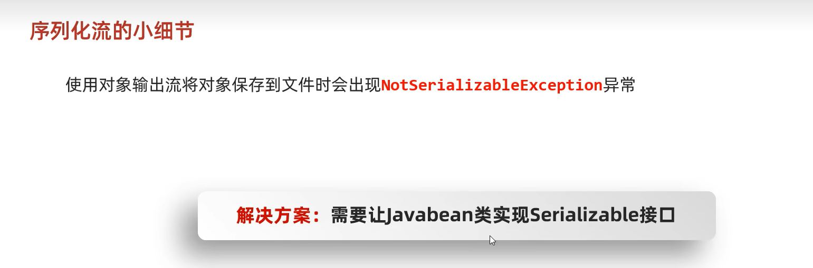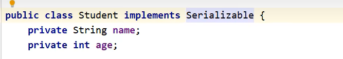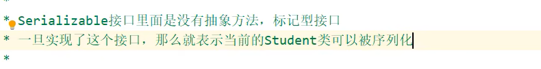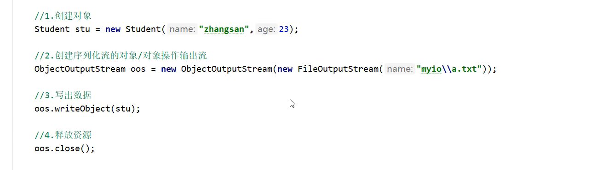

# 反序列化流
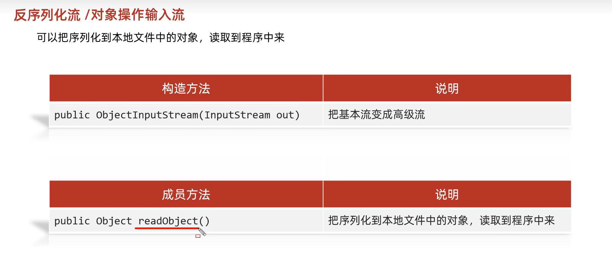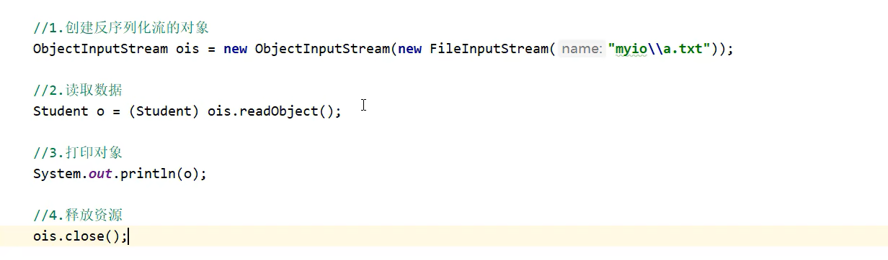

## 异常情况
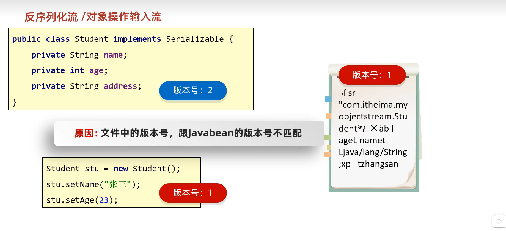解决办法:添加版本号
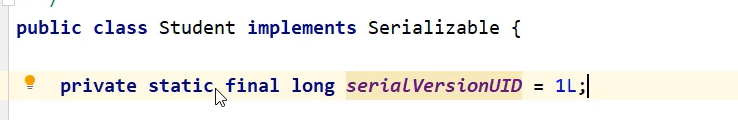
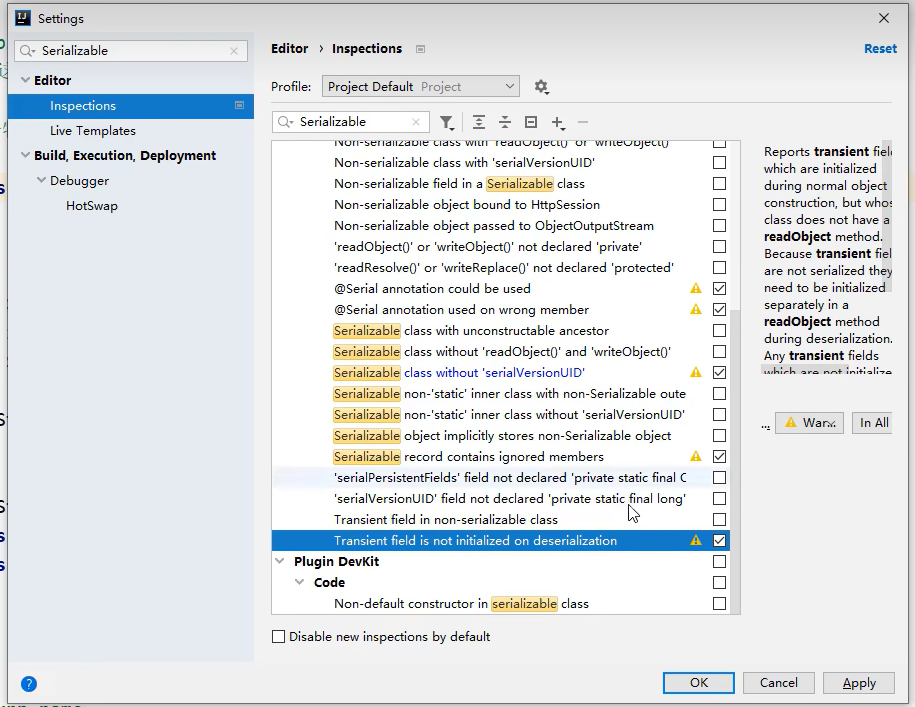

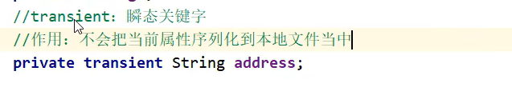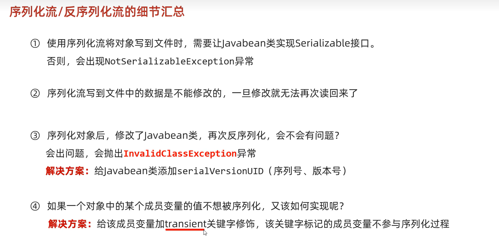
## 读写多个对象
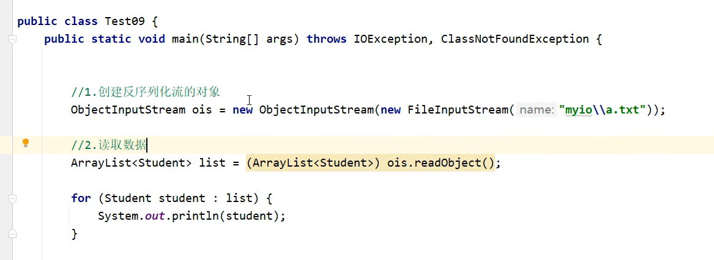

# 打印流
