**task11：**                                    
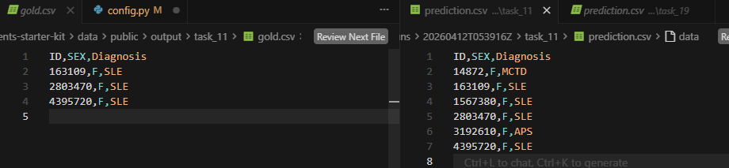
task19：
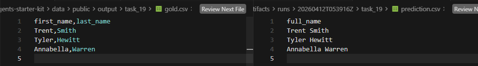
task22：
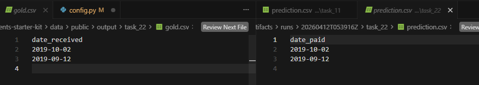
task24：
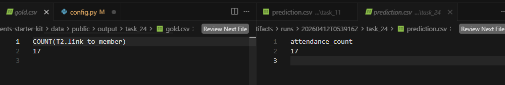
task25:
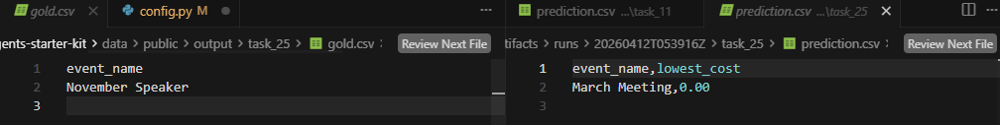
task26:
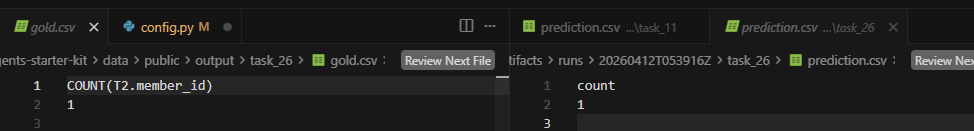
task27:
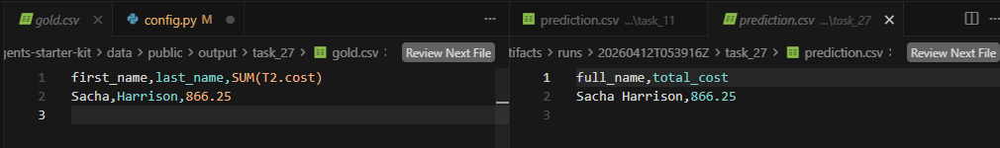
task38:
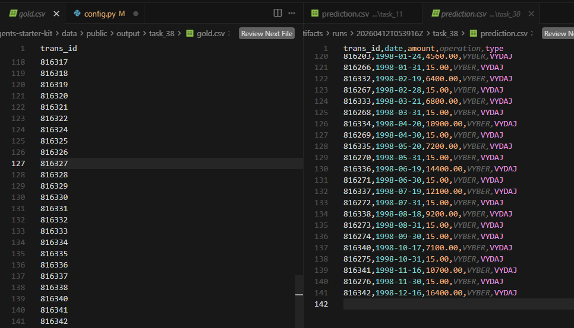
task64:
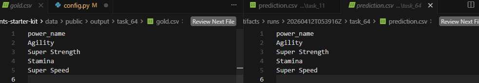
task67:
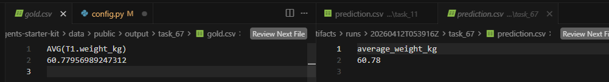
task74:
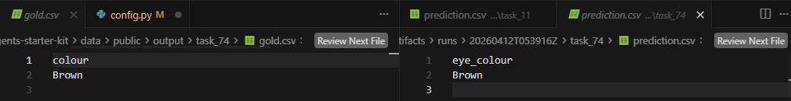
task75:(system failed)
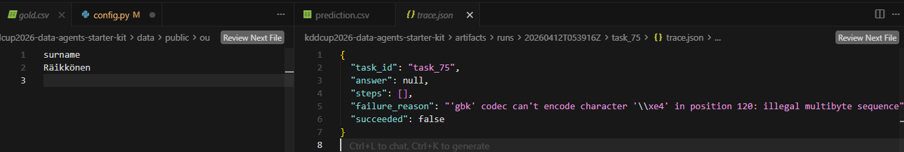
task80:
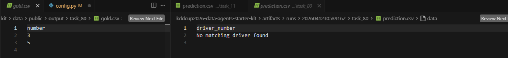task86:
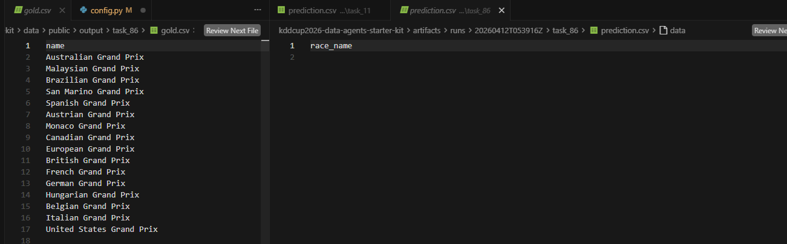
task89:
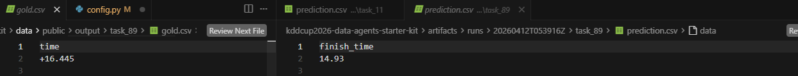
task145:
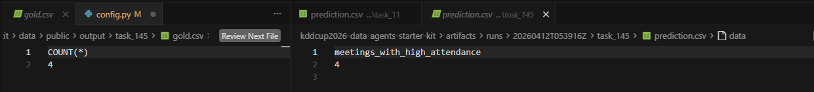
task163:
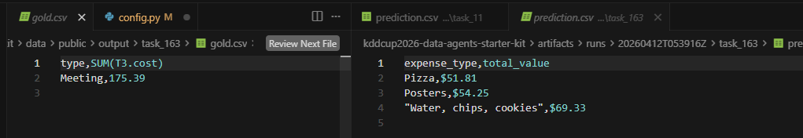
task169:
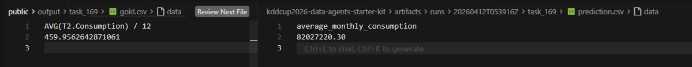
task173:
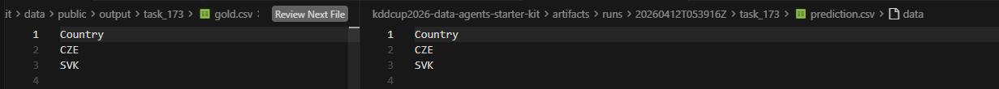
task180:
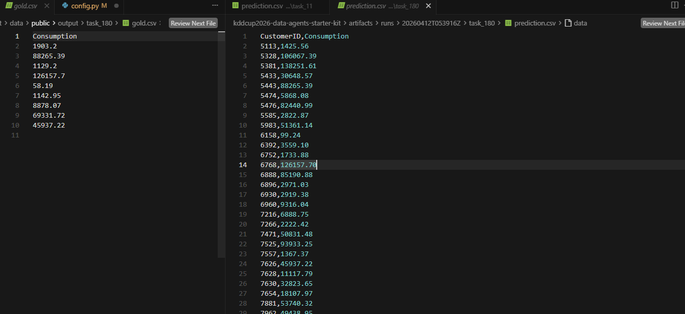
task194:
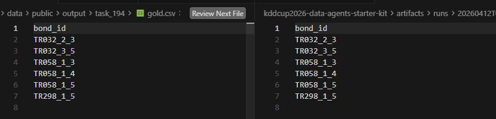
task196:
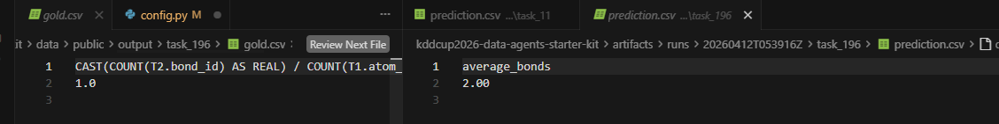
task199:
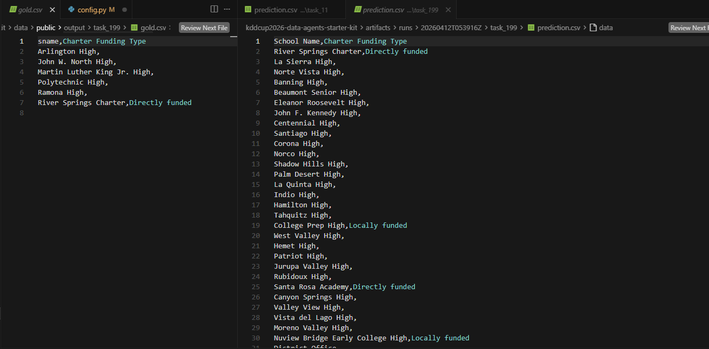
task200:
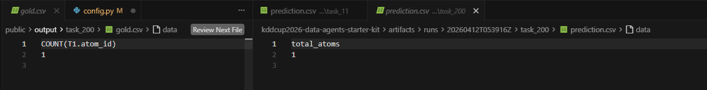
task214:
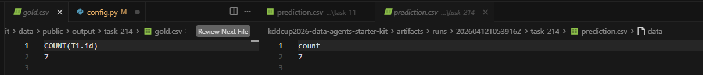
taks218:
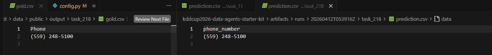
task243:
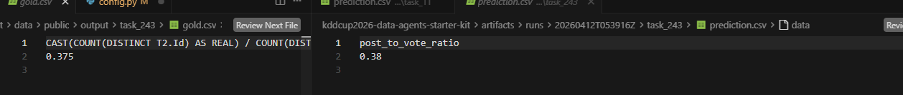
task249:
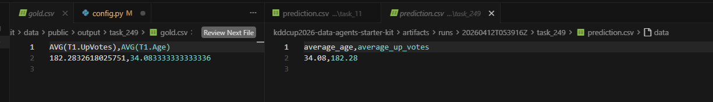
task250(system failed):
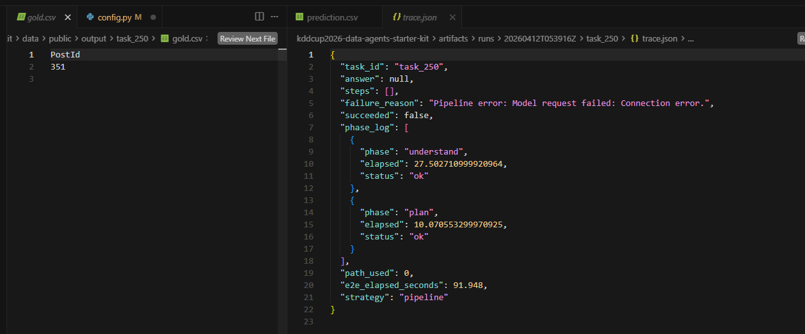task257: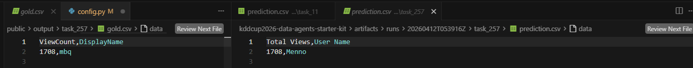
task259:
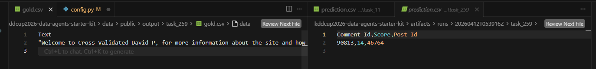
task261:
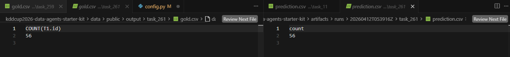
task269:
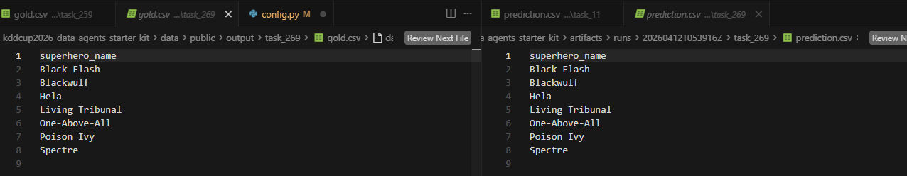
task283:
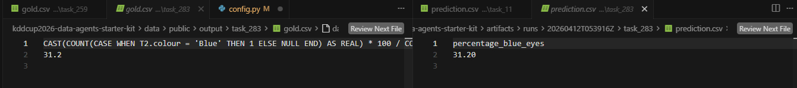
task287:
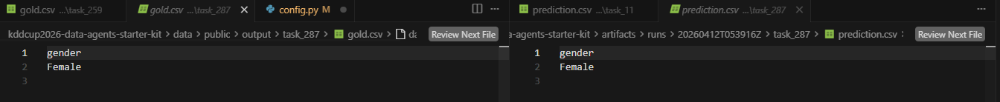
task292:
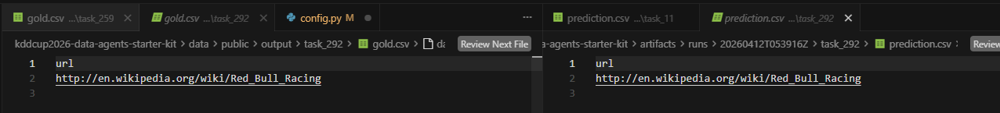
task303:
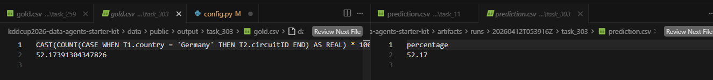task305:
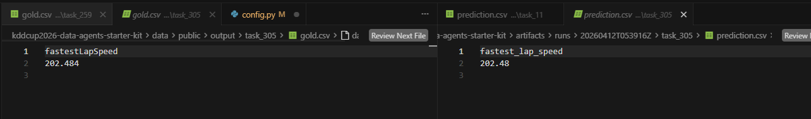
task330(system field):
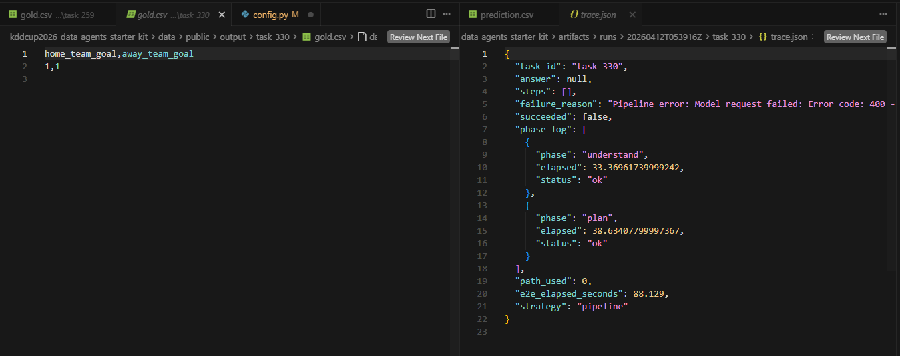task344:
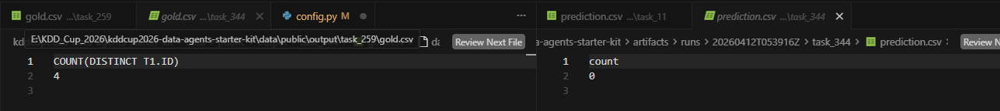
task349:
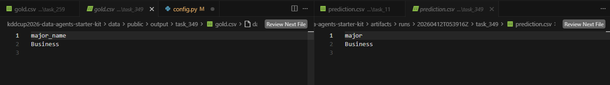
task350:
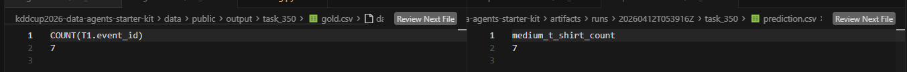
task352:
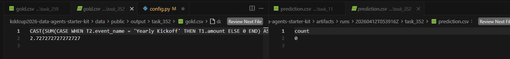
task355:
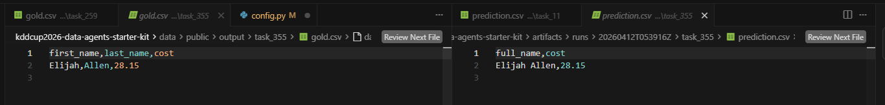
task379:
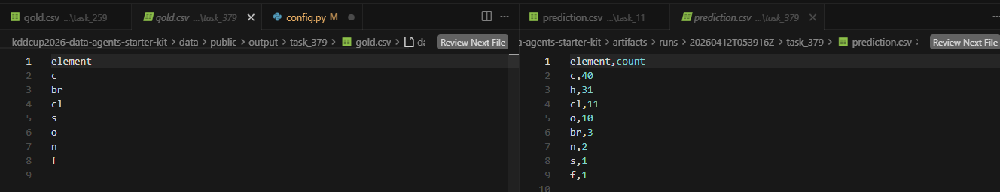
task396(system field):
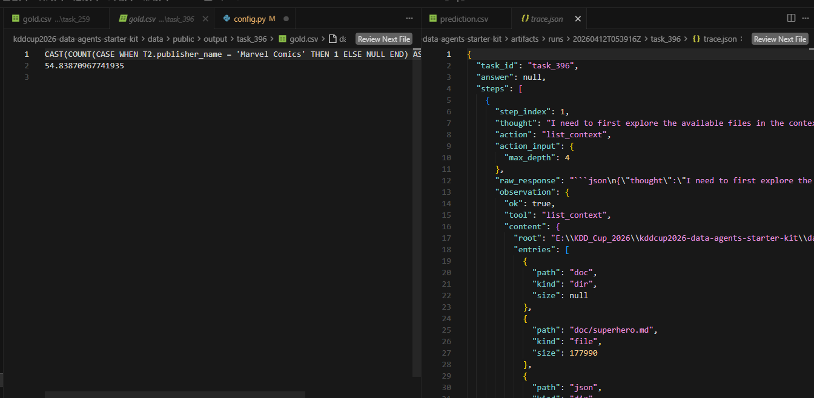
task408:
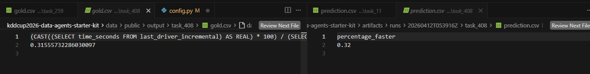
task415:
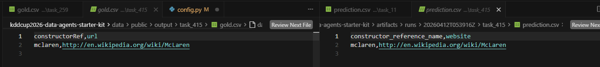
task418(system filed):
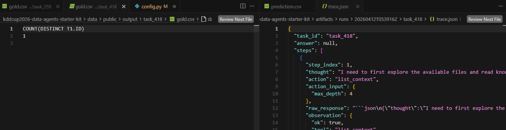
task420(system field):
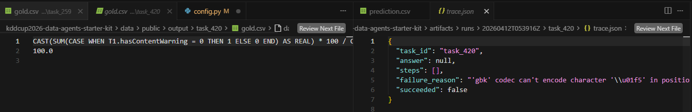

统计：
perfect：27个
部分正确：5个
完全错误：12个
运行失败：6个
